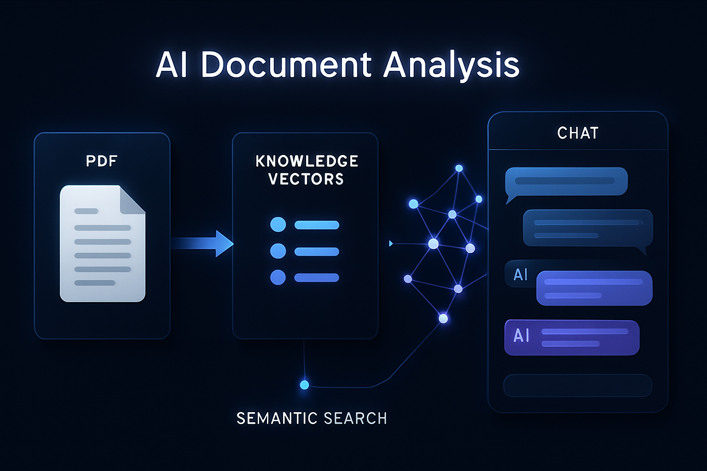
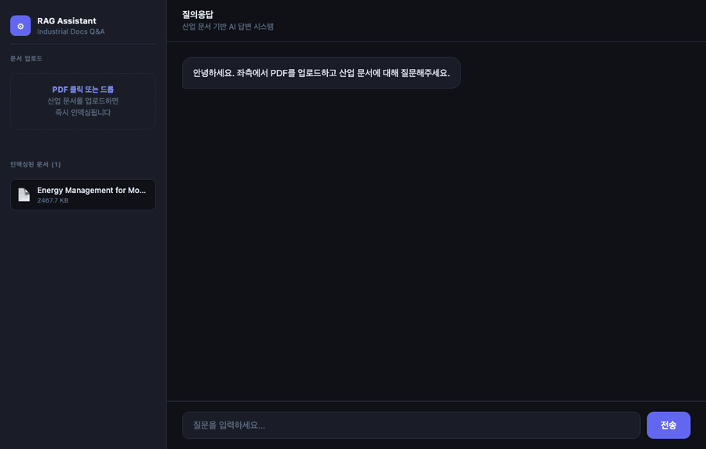

# Industrial RAG Assistant



> 산업 PDF 문서를 업로드하면 자연어로 질의응답할 수 있는 RAG 기반 AI 서비스

[](https://www.python.org/)
[](https://fastapi.tiangolo.com/)
[](https://python.langchain.com/)
[](https://openai.com/)
[](https://faiss.ai/)
[](https://www.docker.com/)

---

## 주요 기능

| 기능 | 설명 |
|------|------|
| **PDF 업로드 & 인덱싱** | 브라우저에서 PDF를 드래그&드롭하면 자동으로 임베딩 및 FAISS 저장 |
| **자연어 질의응답** | GPT-4o-mini가 문서 내용 기반으로 한국어 답변 생성 |
| **소스 추적** | 답변에 사용된 문서명 + 페이지 번호 표시 |
| **유사도 점수** | 검색된 청크의 FAISS L2 거리 표시 |
| **응답 지연 측정** | 쿼리 전체 파이프라인 latency(ms) 실시간 표시 |
| **다중 문서 지원** | 여러 PDF를 누적 인덱싱하여 통합 검색 |

---

## 아키텍처

```
[ PDF Upload ]
      │
      ▼
[ PyPDF Loader ] → [ RecursiveTextSplitter ]
                          │  chunk_size=500, overlap=50
                          ▼
                  [ OpenAI Embeddings ]
                  text-embedding-3-small
                          │
                          ▼
                    [ FAISS Index ]  ←── persisted locally
                          │
                          │  similarity_search_with_score(k=5)
[ User Question ] ────────┤
                          ▼
                  [ GPT-4o-mini ]
                  system: industrial analyst
                          │
                          ▼
              [ Answer + Sources + Latency ]
```

---

## 데모



---

## 빠른 시작

### 1. 환경 설정

```bash
git clone https://github.com/your-id/industrial-rag-assistant
cd industrial-rag-assistant
cp .env.example .env
# .env 에 OPENAI_API_KEY 입력
```

### 2. 패키지 설치 및 실행

```bash
pip install -r requirements.txt
uvicorn app.main:app --reload --port 8000
```

브라우저에서 `http://localhost:8000` 접속 후 PDF 업로드 → 질문

### 3. Docker

```bash
docker build -t industrial-rag-assistant .
docker run -p 8000:8000 --env-file .env industrial-rag-assistant
```

---

## API

| Method | Endpoint | 설명 |
|--------|----------|------|
| `GET`  | `/`          | Web UI |
| `GET`  | `/health`    | 헬스 체크 |
| `GET`  | `/documents` | 인덱싱된 문서 목록 |
| `POST` | `/upload`    | PDF 업로드 & 인덱싱 |
| `POST` | `/ingest`    | `data/` 폴더 일괄 인덱싱 |
| `POST` | `/query`     | 질의응답 |

### `/query` 요청/응답

```jsonc
// Request
{ "question": "모터 에너지 절감 방법은?", "top_k": 5 }

// Response
{
  "answer": "모터 구동 시스템의 에너지 절감을 위해서는...",
  "sources": [
    { "file": "motor_efficiency.pdf", "page": 12, "score": 0.1823 }
  ],
  "latency_ms": 1240,
  "retrieved_chunks": 5
}
```

---

## 설정

`app/config.py` 또는 `.env` 파일로 조정:

| 변수 | 기본값 | 설명 |
|------|--------|------|
| `OPENAI_API_KEY` | — | OpenAI API 키 (필수) |
| `LLM_MODEL` | `gpt-4o-mini` | 답변 생성 모델 |
| `EMBEDDING_MODEL` | `text-embedding-3-small` | 임베딩 모델 |
| `CHUNK_SIZE` | `500` | 청크 크기 (tokens) |
| `CHUNK_OVERLAP` | `50` | 청크 오버랩 |

---

## 기술 스택

- **Backend**: FastAPI + uvicorn (비동기 처리)
- **RAG**: LangChain + FAISS (L2 유사도 검색)
- **LLM**: OpenAI GPT-4o-mini
- **Embedding**: text-embedding-3-small (1536-dim)
- **Frontend**: Vanilla JS (dependency-free)
- **Container**: Docker (python:3.11-slim)
- **Test**: pytest + FastAPI TestClient

---

## 테스트

```bash
pytest tests/ -v
```
